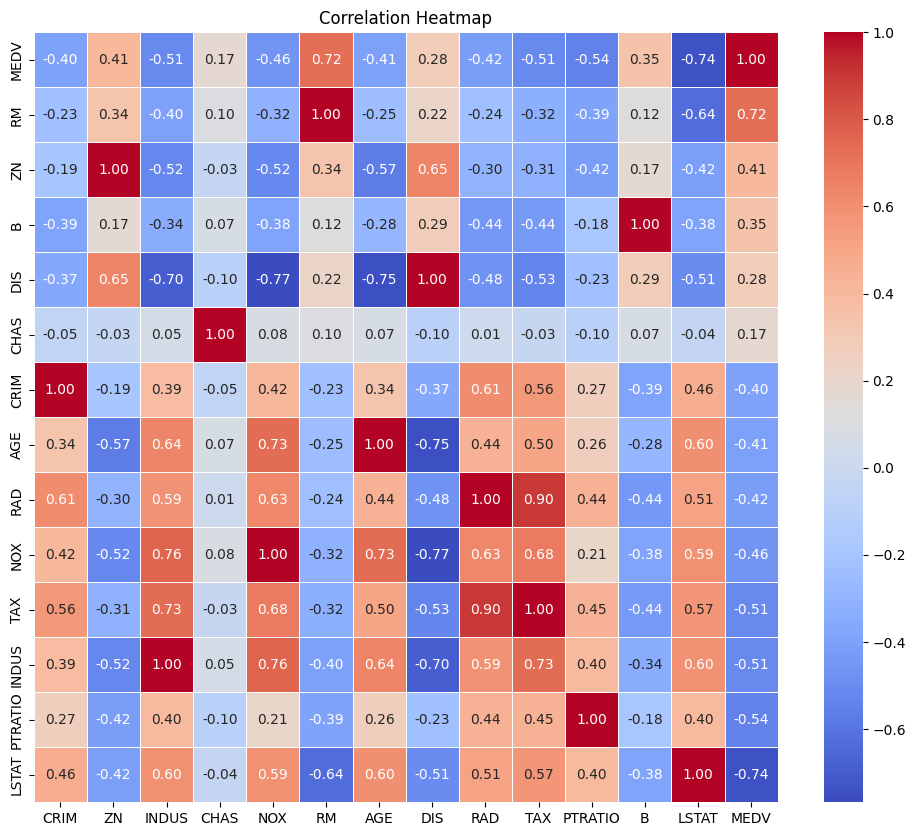

# 📌 Linear Regression from Scratch and with Sklearn

This project demonstrates linear regression on the Boston Housing dataset, starting with univariate linear regression and moving to multi-feature linear regression — both implemented from scratch using numpy and compared with sklearn’s implementation.

---

## 📂 Project Structure

├── Linear_Regression.ipynb # Jupyter notebook with full workflow
├── README.md # This file
└── data/ # Folder for dataset files (if any)


---

## 🚀 What’s Inside?

✅ **Univariate Linear Regression**  
- Built manually with gradient descent.
- Compared against sklearn’s `LinearRegression`.
- Explored features like feature scaling, learning rate tuning, and plotting fitted lines.

✅ **Multi-feature Linear Regression**  
- Chose best features using correlation heatmap.
- Built a manual multi-feature model with vectorized gradient descent.
- Compared results with sklearn’s model.

✅ **Evaluation Metrics**
- Calculated MSE & RMSE.
- Visualized cost function convergence.

✅ **Data Exploration**
- Plotted heatmaps, scatter plots, and boxplots.
- Identified and discussed outliers.

---

## 📊 Results

- Manual model RMSE ≈ 4.97.
- Results very close to sklearn’s model → manual implementation validated.
- Cost function convergence curve shows effective learning.

---

## 🛠️ Technologies Used

- Python
- NumPy
- Pandas
- Matplotlib
- Seaborn
- Scikit-learn

---

## 📝 How to Run

1. Clone the repository:
    ```bash
    git clone https://github.com/yourusername/linear-regression-from-scratch.git
    cd linear-regression-from-scratch
    ```

2. Install dependencies (preferably in a virtual environment):
    ```bash
    pip install -r requirements.txt
    ```

3. Open the notebook:
    ```bash
    jupyter notebook Linear_Regression.ipynb
    ```

---

## 📷 Sample Visualizations

- Correlation Heatmap:
  

- Cost Function Convergence:
  

---

## 📚 References

- [Andrew Ng’s Machine Learning Course](https://www.coursera.org/learn/machine-learning)
- [Hands-On Machine Learning with Scikit-Learn, Keras, and TensorFlow](https://www.oreilly.com/library/view/hands-on-machine-learning/9781492032632/)

---

## ✨ Author

**Omar** – [LinkedIn](www.linkedin.com/in/omar-ehab-eid) | [GitHub](https://github.com/omarehab15/AI-Data_Science.git)

---

## ⭐️ Give the repo a star if you liked the project!
